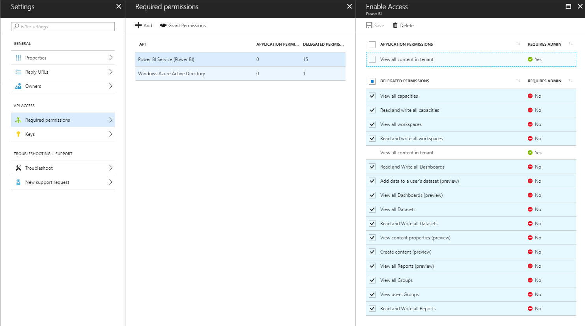

# Power BI Report Embed Example

This is a complete example of how to embed a Power BI report with proper AAD authentication in a web page using JavaScript. I put this together because I could not find a complete example anywhere.

This example applies to the "User owns the data" scenario described here: https://github.com/Microsoft/PowerBI-JavaScript/wiki/Embedding-Basics

## Azure AD Setup

Create an App Registration in the Azure Portal. The app registration in Azure AD must have Power BI permissions as shown below. Not all the permissions shown are required. Experiment with that is needed.

In app registration manifest enable this:

    "oauth2AllowImplicitFlow": true

## Report Configuration

Edit `public/site.js` and enter your `tenant` and `clientId` of the app registration.

Edit `public/index.html` and enter your `report id` and `group id` of the Power BI Workspace.

## Run

Install packages

    npm install
    
To run the example:

    npm run dev

Browse to http://localhost:3000

